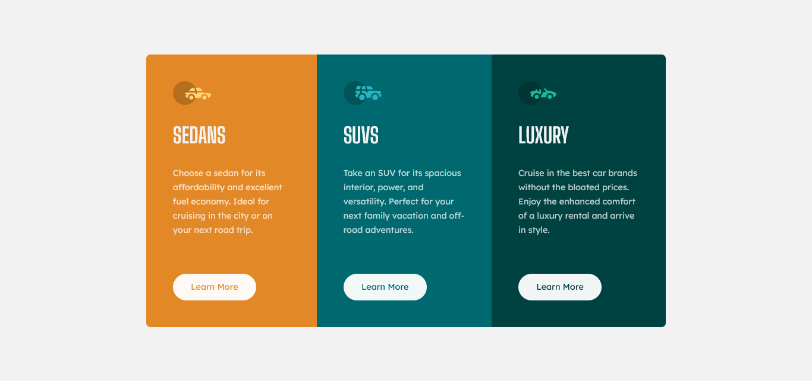

# Frontend Mentor - 3-column preview card component solution

This is a solution to the [3-column preview card component challenge on Frontend Mentor](https://www.frontendmentor.io/challenges/3column-preview-card-component-pH92eAR2-). Frontend Mentor challenges help you improve your coding skills by building realistic projects. 

## Table of contents

- [Overview](#overview)
  - [The challenge](#the-challenge)
  - [Screenshot](#screenshot)
  - [Links](#links)
- [My process](#my-process)
  - [Built with](#built-with)
- [Author](#author)

## Overview

### The challenge

Users should be able to:

- View the optimal layout depending on their device's screen size
- See hover states for interactive elements

### Screenshot

### Links

- Solution URL: [3-column preview card component using Flexbox](https://www.frontendmentor.io/solutions/3column-preview-card-component-using-flexbox-5di-z9KLIY)
- Live Site URL: [Frontend Mentor - 3-column preview card component solution](https://dazzling-zabaione-e0a268.netlify.app/)

## My process

### Built with

- Semantic HTML5 markup
- CSS custom properties
- Flexbox

## Author

- Frontend Mentor - [@Mamouty](https://www.frontendmentor.io/profile/Mamouty)
- LinkedIn - [Mahmoud Guefri](https://www.linkedin.com/in/mahmoud-guefri-6b0269193/)
